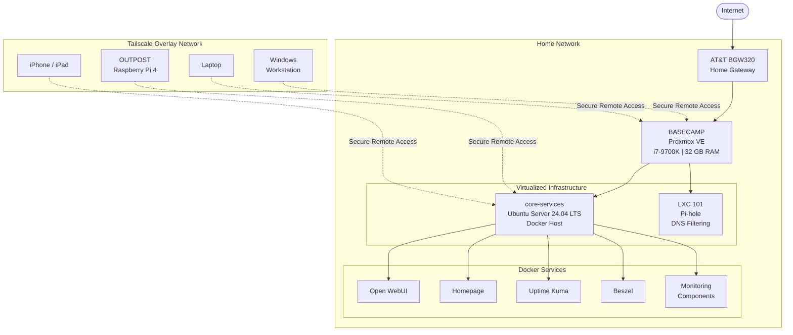

# Basecamp Infrastructure Diagram

## Architecture Summary

Basecamp acts as the primary virtualization host for the homelab.

Proxmox VE separates infrastructure workloads into virtual machines and Linux containers. The `core-services` Ubuntu Server VM hosts containerized applications through Docker, while Pi-hole operates independently in an LXC container.

Local services communicate across the home LAN, while Tailscale provides authenticated remote connectivity for authorized endpoints without requiring management services to be directly exposed to the public internet.
