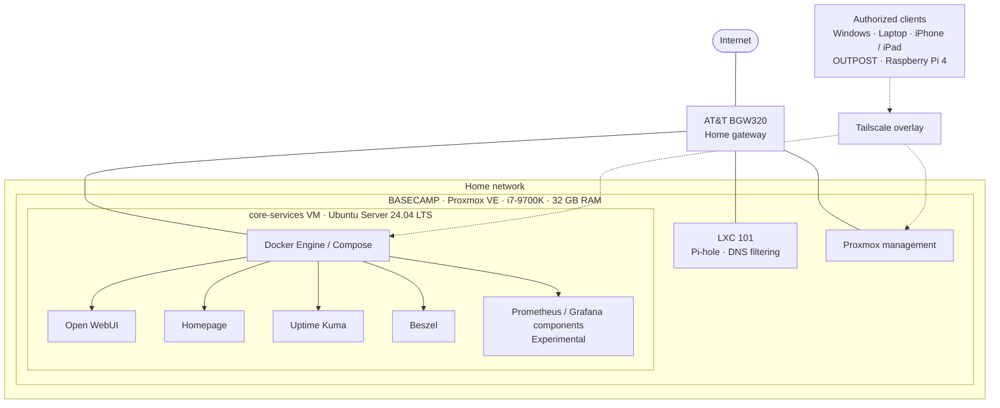

# Basecamp Infrastructure Diagram

[Overview](../README.md) · [Architecture](../docs/architecture.md) · [Networking](../docs/networking.md)

This logical diagram represents the documented baseline. It shows workload placement and remote-access relationships, not physical cabling, firewall policy, subnet routes, or a live health check.

## How to read this diagram

- Nested boxes show hosting: applications run on Docker inside core-services; Pi-hole is a separate LXC on the same physical host.
- Solid lines show logical connectivity or application-host relationships. They do not represent port mappings or packet routes.
- Dashed lines show the documented remote-access relationship through Tailscale. They do not assert that every client is allowed to reach every service.
- Prometheus/Grafana-related work is labeled experimental. Planned VLANs, storage, backups, and GPU workloads are not shown as deployed.

## Failure boundary

Both guests depend on BASECAMP. Separating DNS from the Docker VM helps with application maintenance but does not provide physical redundancy. Monitoring on the same host shares that host's failure boundary.

No private addresses, tailnet names, credentials, or service endpoints are included. Update this diagram alongside the [architecture document](../docs/architecture.md) when the implementation changes.
