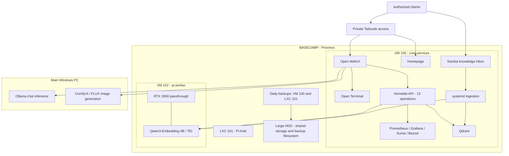

# Basecamp infrastructure diagram

[Overview](../README.md) · [Architecture](../docs/architecture.md)

Logical deployment as reviewed September 26, 2026. Lines express dependencies, not firewall policy or physical cabling.

The Basecamp GPU now serves embeddings. Voice is omitted from the current deployment diagram because its earlier test environment has not been revalidated. ai-worker is absent from the inspected backup job. No addresses, credentials, or private service URLs are shown.
