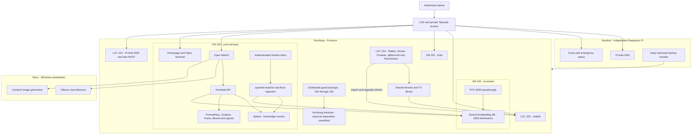

# Middle-earth infrastructure

[Overview](../README.md) · [Architecture](../docs/architecture.md) · [Rebuild](../docs/rebuild.md)

Logical placement synchronized October 6 with Jellyfin/media automation, Arda, Elros and Sentinel. Frozen V1 details remain at the v1.0.0 tag. Lines show dependencies, not complete firewall rules or physical cabling. See the [current state](../docs/current-state.md) for evidence limits.

```mermaid
flowchart TB
    CLIENT[Authorized clients] --> ACCESS[LAN and private Tailscale access]
    subgraph BASE[Hornburg - Proxmox]
      subgraph CORE[VM 100 - core-services]
        UI[Open WebUI]
        APPS[Homepage and Open Terminal]
        MON[Prometheus, Grafana, Kuma, Beszel and agents]
        API[Homelab API]
        INBOX[Authenticated Samba inbox]
        INGEST[systemd watcher and flock ingestion]
        QDRANT[Qdrant - knowledge vectors]
        INBOX --> INGEST
        INGEST --> QDRANT
        UI --> API
        API --> QDRANT
        API --> MON
      end
      subgraph WORKER[VM 102 - ai-worker]
        GPU[RTX 3060 passthrough]
        TEI[Qwen3-Embedding-4B - 2560 dimensions]
        GPU --> TEI
      end
      DNS[LXC 101 - Pi-hole DNS and site DHCP]
      JELLY[LXC 103 - Jellyfin]
      MEDIA[LXC 104 - Radarr, Sonarr, Prowlarr, qBittorrent and FlareSolverr]
      ARDA[VM 105 - Arda]
      LIBRARY[Shared Movies and TV library]
      MEDIA --> LIBRARY
      LIBRARY --> JELLY
      MEDIA -->|Import and upgrade refresh| JELLY
      BACKUP[Scheduled guest backups - 100 through 105]
      DISK[hornburg-backups - physical separation unverified]
      BACKUP --> DISK
    end
    subgraph PC[Elros - Windows workstation]
      OLLAMA[Ollama chat inference]
      COMFY[ComfyUI image generation]
    end
    subgraph SENTINEL[Sentinel - independent Raspberry Pi]
      SDNS[Pi-hole DNS]
      SMON[Kuma and emergency status]
      SBACKUP[Daily restricted backup transfer]
    end
    ACCESS --> SDNS
    ACCESS --> SMON
    SBACKUP --> BASE
    ACCESS --> JELLY
    ACCESS --> ARDA
    ACCESS --> UI
    ACCESS --> APPS
    ACCESS --> DNS
    UI --> OLLAMA
    UI --> COMFY
    INGEST --> TEI
    API --> TEI
```

The October 3 cutover record establishes all six guests autostarted; Prometheus required a manual start. Current backup scope is 100–105, daily snapshot/zstd/keep-last=7. The 2 TB class backup pool is observed logically; its physical/off-host protection remains unresolved. Selected isolated restores of 104/105 passed; other guest/data restores remain open. Seerr placement is unverified and omitted. The complete [monitoring triangle](../docs/monitoring.md) is verified 6/6 at runtime; this dependency diagram does not represent every monitoring edge. Private addresses and credentials are excluded. Frozen V1 details remain at the unchanged tag.
