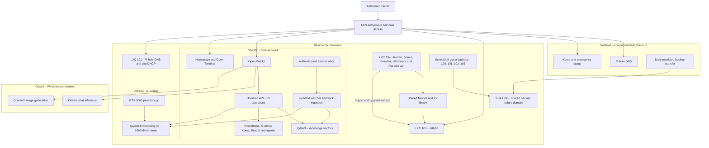

# Basecamp infrastructure

[Overview](../README.md) · [Architecture](../docs/architecture.md) · [Rebuild](../docs/rebuild.md)

Logical placement updated September 29 with Jellyfin/media automation, Citadel and Sentinel. Frozen V1 details remain at the v1.0.0 tag. Lines show dependencies, not complete firewall rules or physical cabling. See the [current state](../docs/current-state.md) for evidence limits.

```mermaid
flowchart TB
    CLIENT[Authorized clients] --> ACCESS[LAN and private Tailscale access]
    subgraph BASE[Basecamp - Proxmox]
      subgraph CORE[VM 100 - core-services]
        UI[Open WebUI]
        APPS[Homepage and Open Terminal]
        MON[Prometheus, Grafana, Kuma, Beszel and agents]
        API[Homelab API - 13 operations]
        INBOX[Authenticated Samba inbox]
        INGEST[systemd watcher and flock ingestion]
        QDRANT[Qdrant - knowledge vectors]
        INBOX --> INGEST
        INGEST --> QDRANT
        UI --> API
        API --> QDRANT
        API --> MON
      end
      subgraph WORKER[VM 102 - ai-worker]
        GPU[RTX 3060 passthrough]
        TEI[Qwen3-Embedding-4B - 2560 dimensions]
        GPU --> TEI
      end
      DNS[LXC 101 - Pi-hole DNS and site DHCP]
      JELLY[LXC 103 - Jellyfin]
      MEDIA[LXC 104 - Radarr, Sonarr, Prowlarr, qBittorrent and FlareSolverr]
      LIBRARY[Shared Movies and TV library]
      MEDIA --> LIBRARY
      LIBRARY --> JELLY
      MEDIA -->|Import and upgrade refresh| JELLY
      BACKUP[Scheduled guest backups - 100, 101, 102, 103]
      DISK[Bulk HDD - shared backup failure domain]
      BACKUP --> DISK
    end
    subgraph PC[Citadel - Windows workstation]
      OLLAMA[Ollama chat inference]
      COMFY[ComfyUI image generation]
    end
    subgraph SENTINEL[Sentinel - independent Raspberry Pi]
      SDNS[Pi-hole DNS]
      SMON[Kuma and emergency status]
      SBACKUP[Daily restricted backup transfer]
    end
    ACCESS --> SDNS
    ACCESS --> SMON
    SBACKUP --> DISK
    ACCESS --> JELLY
    ACCESS --> UI
    ACCESS --> APPS
    ACCESS --> DNS
    UI --> OLLAMA
    UI --> COMFY
    INGEST --> TEI
    API --> TEI
```

The original three guests and eleven core containers recovered in the V1 reboot test; that test does not cover the two new media guests. Guest 104 is not in the current scheduled backup job. Seerr belongs to the recorded request workflow but its current placement was not established, so it is omitted from this placement diagram. Backup archives exist for each guest; isolated restoration and off-host protection remain unverified. Voice is outside this V1 acceptance diagram. No private addresses or credentials are shown.
