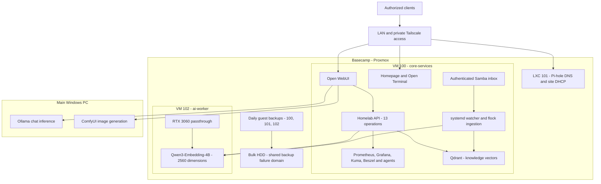

# Basecamp V1 infrastructure

[Overview](../README.md) · [Architecture](../docs/architecture.md) · [Rebuild](../docs/rebuild.md)

Logical deployment at the V1 freeze. Lines show dependencies, not complete firewall rules or physical cabling.

```mermaid
flowchart TB
    CLIENT[Authorized clients] --> ACCESS[LAN and private Tailscale access]
    subgraph BASE[Basecamp - Proxmox]
      subgraph CORE[VM 100 - core-services]
        UI[Open WebUI]
        APPS[Homepage and Open Terminal]
        MON[Prometheus, Grafana, Kuma, Beszel and agents]
        API[Homelab API - 13 operations]
        INBOX[Authenticated Samba inbox]
        INGEST[systemd watcher and flock ingestion]
        QDRANT[Qdrant - knowledge vectors]
        INBOX --> INGEST
        INGEST --> QDRANT
        UI --> API
        API --> QDRANT
        API --> MON
      end
      subgraph WORKER[VM 102 - ai-worker]
        GPU[RTX 3060 passthrough]
        TEI[Qwen3-Embedding-4B - 2560 dimensions]
        GPU --> TEI
      end
      DNS[LXC 101 - Pi-hole DNS and site DHCP]
      BACKUP[Daily guest backups - 100, 101, 102]
      DISK[Bulk HDD - shared backup failure domain]
      BACKUP --> DISK
    end
    subgraph PC[Main Windows PC]
      OLLAMA[Ollama chat inference]
      COMFY[ComfyUI image generation]
    end
    ACCESS --> UI
    ACCESS --> APPS
    ACCESS --> DNS
    UI --> OLLAMA
    UI --> COMFY
    INGEST --> TEI
    API --> TEI
```

All three guests and all eleven core containers recovered in the recorded reboot test. Backup archives exist for each guest; isolated restoration and off-host protection remain unverified. Voice is outside this V1 acceptance diagram. No private addresses or credentials are shown.
