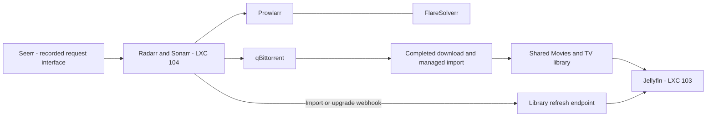

# Jellyfin and media automation

[Overview](../README.md) · [Architecture](architecture.md) · [September 29 change record](changes/2026-09-29.md) · [Backups](backup-recovery.md)

## Placement and observed state — September 29, 2026

Jellyfin adds a dedicated media-serving workload to Basecamp. Media automation lives in a separate guest rather than the original core-services Docker project. This is a post-V1 operating addition; the immutable V1 Compose recipe and version manifest do not provision it.

| Component | Placement and role | Evidence |
| --- | --- | --- |
| Jellyfin | Unprivileged LXC 103; 2 cores, 2 GiB RAM; media library and playback server | Guest running, service active, local health response healthy; installed server package `12.1+deb13` |
| Media automation | Unprivileged LXC 104; 2 cores, 4 GiB RAM | Guest running; autostart enabled, as on guest 103 |
| Radarr / Sonarr | Docker in guest 104; movie/TV management and import notifications | Both running; one matching Jellyfin webhook each, with import and upgrade triggers enabled |
| Prowlarr | Docker in guest 104; indexer coordination | Running; prior troubleshooting record documents a successful search after earlier failures |
| qBittorrent | Docker in guest 104; download client | Running; a complete media download/import/playback test is not established by this check |
| FlareSolverr | Docker in guest 104; configured Prowlarr companion | Running; prior session recorded readiness and connectivity from Prowlarr |
| Seerr | Request interface in the recorded workflow | Prior request handoff to Radarr was recorded; current placement and health were not established by today's check |

These observations are point-in-time checks, not a media playback, performance or whole-stack restart acceptance test. The two new guests are outside the original eleven core-services containers and outside the daily core-only inventory collector's scope.

## Storage and request flow

The setup record maps automation libraries at `/data/Media/Movies` and `/data/Media/TV` to the same underlying library Jellyfin sees at `/srv/media/Movies` and `/srv/media/TV`. Today's guest configuration independently confirms a `/srv/media` mount in Jellyfin. Complete mount equivalence and permissions were recorded in the setup session, not re-tested through a new import today.

Seerr sends requests; it does not copy media into Jellyfin. Successful acquisition, completed import, library refresh, indexing and playback are separate stages. Use owned or otherwise authorized test media for acceptance.

## Refresh integration and troubleshooting

Both Arr applications have one saved **Jellyfin Webhook Refresh** connection. Read-only checks confirmed import/download and upgrade triggers and the `/Library/Refresh` URL path. The setup session reported successful connection tests and Jellyfin HTTP 204 acceptance. No new refresh or import was forced during today's documentation check.

The setup encountered a duplicate connector name while saving a replacement. A uniquely named webhook was tested and saved; the session then reported removal of the old failed connectors. The current single-match checks support the resulting configuration. API keys and authorization headers remain private.

A separate search failure came from category mismatch: the configured software/Linux source did not provide movie/TV categories. Request delivery to Radarr succeeded, but no suitable search result reached the downloader. Later session records show an indexer search returning results. This does not prove the subsequent download, managed import or Jellyfin playback. Compare timestamps when reviewing errors; older access failures can remain in logs after a successful later search.

## Operating checks

1. Check guest 103 and 104 state and autostart, then Jellyfin service health and the five media containers.
2. Confirm the library mount is present before scanning; inspect path/permission correspondence privately between the downloader, Arr applications and Jellyfin.
3. Check request handoff, indexer categories and current search results separately from download and import status.
4. Inspect the saved refresh connection without copying headers or keys. An HTTP acceptance result does not by itself prove library indexing completed.
5. For an end-to-end test, record an authorized sample's request, completed download, import, library visibility and playback result. Preserve a sanitized outcome rather than private media titles, client identities or raw logs.

## Recovery limits

The enabled Proxmox backup job explicitly covers guests **100, 101, 102 and 103**. It does **not** list media-automation guest **104**. This verifies scheduled scope, not a successful backup archive or restore of Jellyfin. Confirm app-state backups for guest 104 before treating the media stack as recoverable.

Jellyfin's mounted media requires its own backup assessment; guest backup inclusion does not establish protection for externally mounted library data. No isolated restoration, hardware-transcoding acceptance, performance benchmark or complete media-stack restart drill was performed in this update. Private service configuration and pinned rebuild artifacts for the media stack remain outside the public V1 reproduction package.
