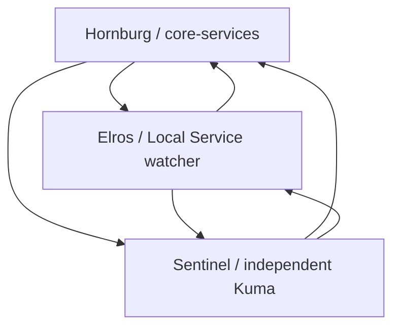

# Independent monitoring triangle — October 6, 2026

[Overview](../README.md) · [Current state](current-state.md) · [Operations](operations.md) · [Sentinel](sentinel.md)

All **6/6 directed relationships were verified at runtime** in canonical E10. The objective is independent outside-in visibility from three machines, without cloning the complete observability stack. Core-services is Hornburg's monitoring failure domain; Sentinel and Elros observe the host directly.

| Observer → peer | Continuous checks verified UP | Diagnostic scope |
| --- | --- | --- |
| Hornburg/core-services → Elros | Prometheus Windows exporter; existing Kuma SSH/exporter TCP checks | Host metrics and listener reachability |
| Hornburg/core-services → Sentinel | New Kuma independent host-health JSON and Kuma HTTP checks | Host identity, timestamp freshness, healthy local services and watcher availability |
| Sentinel → Hornburg | Existing Kuma host/core ping, primary Pi-hole HTTP and DNS checks | Host and important infrastructure availability |
| Sentinel → Elros | Existing Kuma Ollama TCP check | Application listener; Windows exporter also passed a one-time probe, not continuous monitoring |
| Elros → Hornburg | SSH TCP, Proxmox management TCP, host exporter HTTP/metric marker, core API health HTTP | Host reachability/metrics; API response does not establish every downstream dependency |
| Elros → Sentinel | SSH TCP, Kuma HTTP, independent host-health JSON | Fresh direct host/service state |

## Lightweight watcher and startup

Elros uses the same `Elros-Homelab-Watcher` scheduled task, now under `NT AUTHORITY\LOCAL SERVICE` with ServiceAccount logon and limited privilege. A boot trigger delayed 45 seconds plus one-minute repetition, StartWhenAvailable and IgnoreNew replace the interactive-logon dependency. Built-in Windows PowerShell avoids Python/profile/password dependencies. Protected source is under `C:\ProgramData\MiddleEarthMonitoring\bin`; only SYSTEM/Administrators can modify it. Local Service writes the separate `data` directory.

The local JSON/HTML status and bounded 500-event history report seven checks; two consecutive failures confirm DOWN and results over three minutes old are stale. Repeated actual scheduled runs under Local Service passed with advancing timestamps and task result 0, last recorded 11:37:20 UTC. Original task/source rollback material remains private. No actual signout/reboot test was performed.

Core's two new Sentinel Kuma checks run every 60 seconds, timeout 8 seconds, two retries at 20 seconds. Health acceptance requires Sentinel identity, healthy state, non-stale status and a timestamp under six minutes old, with one-minute future-clock tolerance. Wrong-host, stale and unhealthy fixtures were rejected. Core Docker is enabled and the six monitoring containers use `unless-stopped`; Sentinel Docker, Pi-hole, dashboard and health timer are active/enabled, with health boot delay 90 seconds then two-minute checks. Sentinel's local health collection does not depend on Hornburg.

## Verification and remaining acceptance-hardening

- All nine core Kuma checks and all four Prometheus targets UP at final readback; ten Sentinel Kuma checks UP during morning inspection. No production outage/reboot was induced.
- Notification-disabled disposable Kuma and TCP fixtures passed UP → DOWN → UP; disposable checks were removed. Existing monitoring remained healthy.
- Existing Sentinel ntfy destination accepted a generic priority-1 test (HTTP 200); matching message retrieved from cache. Configuration unchanged. Device receipt and actual monitor DOWN/recovery delivery remain unverified.
- New core Sentinel checks have no assigned notifications; Elros currently records local status/events only. No arbitrary external notification platform was introduced. Prometheus has no loaded rule groups or Alertmanagers in the audit.
- Actual boot acceptance awaits separately approved maintenance, including the earlier unexplained Prometheus restart miss. Configuration/service-token execution is verified; reboot behavior is not newly proven.
- LXC 103/104 Beszel coverage and authenticated Grafana query acceptance remain unverified. These are follow-ups, not blockers to the completed six-direction triangle.

Private endpoint addresses, notification destinations, credentials and rollback contents are intentionally omitted. This documentation sync does not deploy or change runtime configuration.
